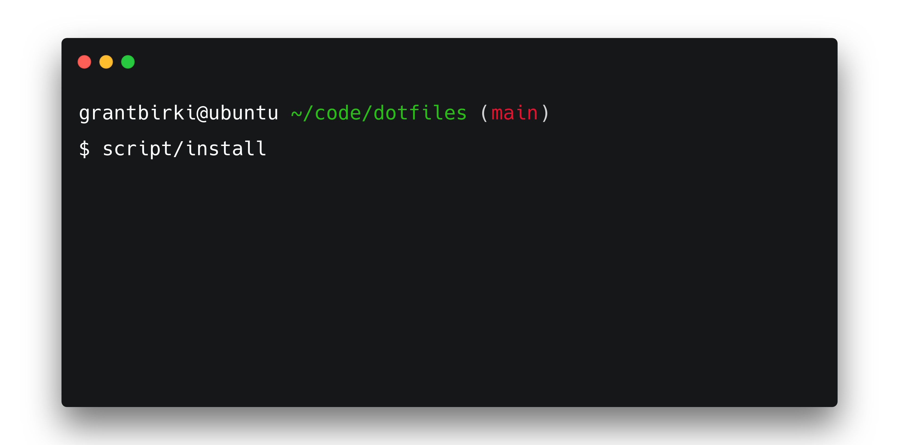

<h1 align="center">dotfiles 📂</h1>

  Dotfiles and general machine / terminal configurations

<h2 align="center"></h2>

## About 💡

This repository is a personal collection of my dotfiles for work and fun

These files have been tested to work on the following operating systems:

- Linux
- MacOS

> Note: All terminal dotfiles are for `bash`

## Setup ⚙️

If you wish to install these files on a brand new machine, simply do the following:

1. Clone this repository
2. Run `script/install`

> This will symlink all the defined files in the `script/install` script and backup your current dotfiles so they can be recovered later if something is not working correctly

If anything goes wrong, you can always run `script/restore` to roll back your original dotfiles

## Table of Contents 📚

- [dotfiles](./dotfiles/)
- [alacritty config](./configs/alacritty/alacritty.yml)
- [management scripts](./script/)
