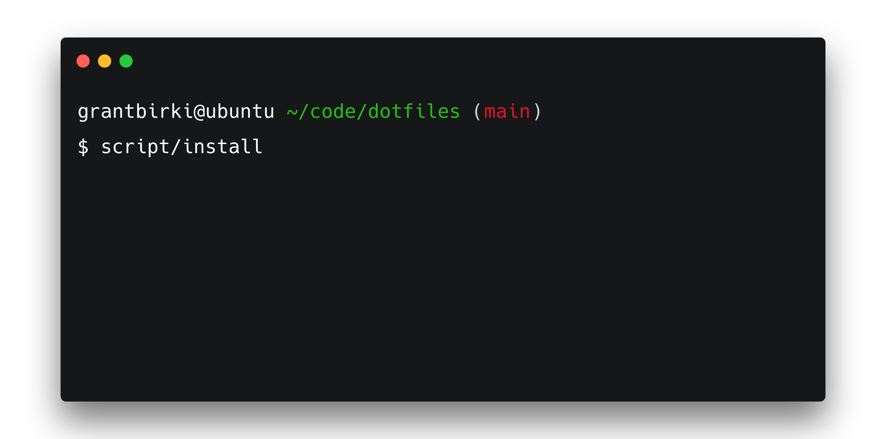

# dotfiles 📁

[](https://github.com/GrantBirki/dotfiles/actions/workflows/test.yml)

Personal macOS dotfiles for shell, Git, terminal, keyboard, and VS Code setup.



## Quickstart 🚀

To install these dotfiles, simply run the following:

```bash
script/install
```

More detailed command reference:

```bash
script/bootstrap
script/install --dry-run
script/install
script/doctor
```

## What It Manages

- Bash, Git, Ruby, profile, alias files, and Secretive-backed Git SSH helpers
- Alacritty and Karabiner-Elements config
- VS Code settings, keybindings, tasks, snippets, extensions, and policy

## Docs

- [Usage](docs/usage.md)
- [VS Code](docs/vscode.md)
- [Development](docs/development.md)
